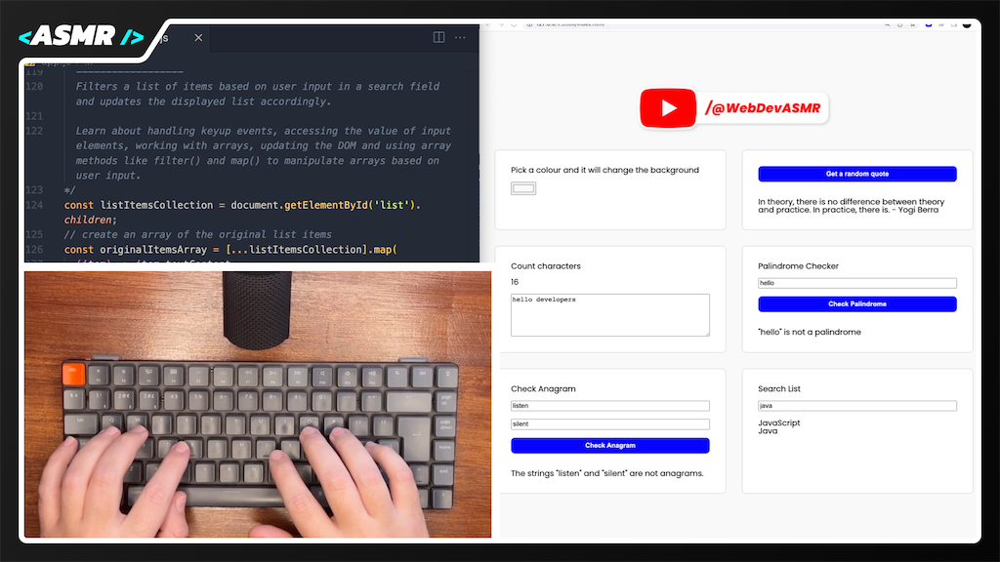

# Master JavaScript Basics | WebDevASMR

Hone your JavaScript skills with 6 beginner-friendly projects.
Delve into fundamental concepts as you code a color changer, quote generator, character counter, palindrome and anagram checkers, and a search filter for a list.

[Watch the video here:](https://youtu.be/Lw9RKe3jqvQ?sub_confirmation=1)

