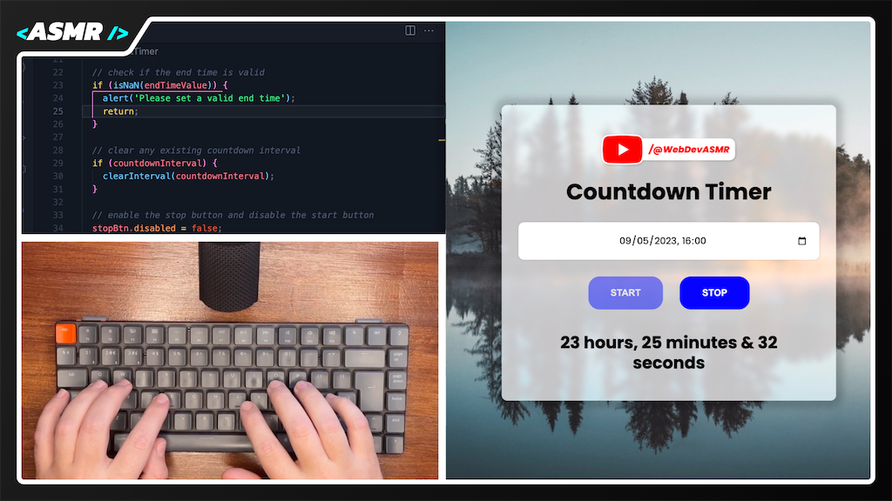

# Simple Countdown Timer | WebDevASMR

Advance your JavaScript skills with this intermediate-level Countdown Timer project. Practice working with the Date object, setInterval, and updating the DOM to display a dynamic countdown timer.

[Watch the video here:](https://youtu.be/VgN8EPM18Vo?sub_confirmation=1)

