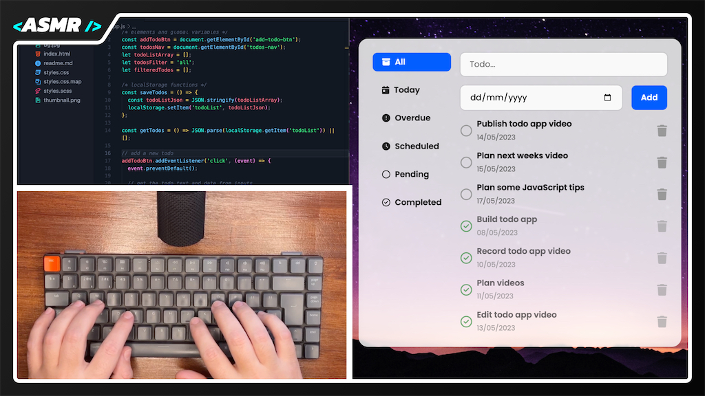

# Todo App | WebDevASMR

Build an intermediate-level To-do list application using HTML, SCSS, and JavaScript. Learn to handle form submissions, manage state with arrays and objects, and update the DOM.

This project takes a step further as we employ SCSS instead of CSS, leveraging a Visual Studio Code extension to compile our SCSS code into CSS. This efficient workflow helps create a practical, user-friendly to-do list app.

[Watch the video here:](https://youtu.be/RcaGDcydOss?sub_confirmation=1)

