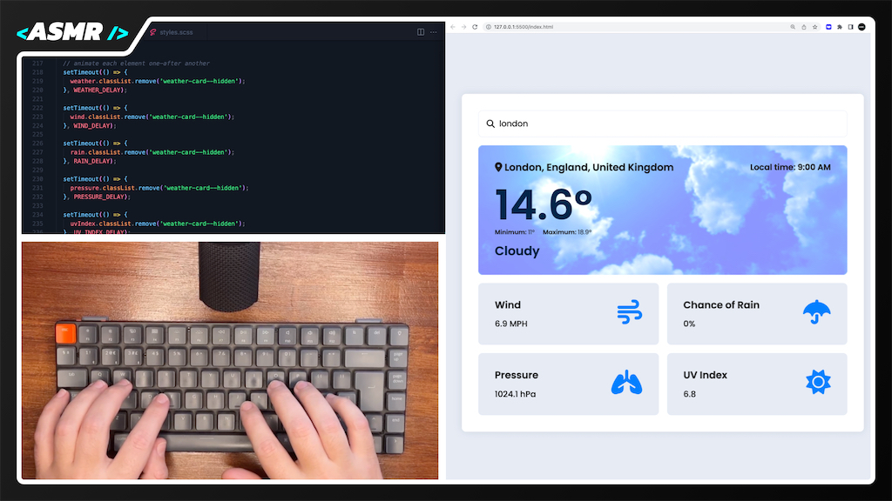

# Weather App | WebDevASMR

Build a Weather App using HTML, SCSS, and JavaScript. This project involves working with multiple APIs for location search, geocoding, and fetching weather data.
Images are from [Unsplash.com](https://unsplash.com)

[Watch the video here:](https://youtu.be/6rh4hmpB8cw?sub_confirmation=1)

